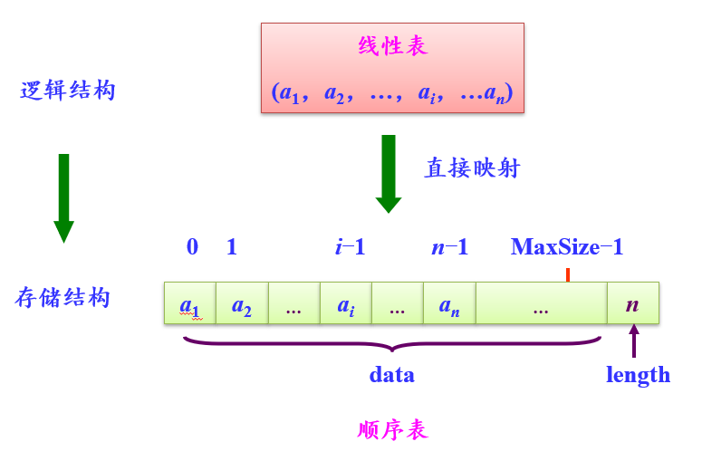
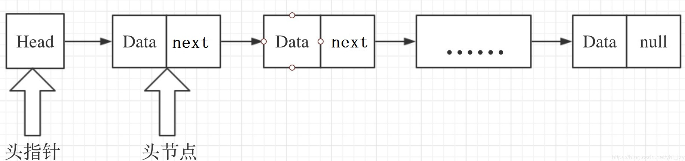
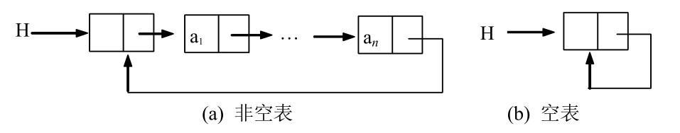
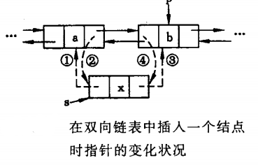

[[toc]]
## 线性表的类型定义
**线性表**：由0或多个具有相同类型的结点组成的有序集合。
$$
(a_1,a_2,a_3,...,a_n)
$$
      
当$n=0$时，线性表中无节点，这样的线性表为空表；当$n\ge 1$时，$a_1$为线性表的表头，$a_n$为线性表的表尾；当$n\ge 2$时，$a_i$为$a_{i+1}$的前驱结点，$a_{i+1}$为$a_i$的后驱结点

**线性表的基本操作：**
1. 创建一个线性表
2. 确定线性表的长度
3. 确定线性表是否为空
3. 存取表中指定位置结点的字段值
4. 查找指定字段值的表中的位置
5. 删除表中指定位置的结点
6. 在表中指定位置插入一个新结点

[[toc]]
## 线性表的顺序存储结构
**顺序存储方式**：用一组连续的存储地址来存储线性表中的结点的存储方式

**顺序表**：按照顺序存储方式存储的线性表称为顺序表

线性表
$$(a_1,a_2,a_3,...,a_n)$$

存储结构：

**特点**：
1. 存储地址连续
1. 数据元素存储依次存放
1. 数据元素类型相同
1. 数据元素可随机存取

**优点**：存储空间的利用率高，存取速度快

**缺点**：
1. 在插入、删除某个元素时，需要移动大量元素
1. 静态存储形式，数据元素的个数不能自由扩充

[[toc]]
## 线性表的链式存储结构
线性表的顺序存储使用一段连续的物理地址存储数据，可以随机存取任意元素，但是在进行插入和删除操作时需要移动大量的元素。因此本节介绍链式存储，元素的存储位置随意，规避了顺序存储的缺点。

采用任意的存储单元存储线性表的数据元素是线性链表的特点。而为了表示两个元素之间的逻辑关系，需要知道直接后继的存储位置。

数据元素的存储映像成为**结点**，其中结点由**数据域**和**指针域**两部分组成。**数据域**存放该结点的数据域的值，**指针域**存放该结点的后继结点的地址信息

由$n$个这样的结点连接成的线性表成为**链表**。

链表的存储单元可以是连续的，也可以是不连续的，结点间的逻辑顺序与物理存储顺序之间没有必然联系

**头指针**：指向链表中第一个结点的指针

**首元结点**：链表中存储第一个数据元素的结点

**头结点**：链表的首元结点之前附设的一个结点

头结点的数据域可以为空，也可以存放线性表长度等附加信息，但此结点不能计入链表长度值

## 单链表
**单链表**：结点只有一个指针域的链表

**带头结点的单链表**：

**空表**：

在链表中若$p$为指向第$i$个元素的指针，则$p.next$指向第$i+1$个元素,$p.data=a_i$,$p.next.data=a_{i+1}$。所以访问时只能通过头指针进入链表，并通过每个结点的指针域一次向后顺序扫描其他结点，所以寻找第一个结点和最后一个节点所花的时间不等

### 单链表的插入
若要将结点$x$插入到已存在的链表中，只需要修改链表中的指针即可。
如图所示：首先找到结点$x$应插入的位置，然后将$a$结点的指针修改为指向$x$结点，将$x$的指针指向$b$。若$p$为指向结点$a$的指针，则指针的修改关系为：

$$x.next=p.next,p.next=x$$

### 单链表的删除
与单链表的插入类似，若要删除链表中的某结点，只需要修改链表的指针即可。
如图所示：首先找到删除结点$b$的前一个结点$a$,然后将$a$结点的指针指向$c$结点。若$p$为指向结点$a$的指针，则指针的修改关系为：

$$p.next=p.next.next$$

## 循环链表
**循环链表**：链表最后一个结点的指针域指向头结点，链表形成一个环。因此可以从任一结点找到其他结点。

**空循环链表**：单链表只包含一个头指针的哨位结点，其指针域存放指向自身的指针。

循环链表可以从任意位置访问任意结点，所以链表遍历一遍的终止条件为结点的指针是否指向头指针，但是想获取结点的前驱结点，仍需遍历整个链表；循环链表的插入和删除与单链表类似。

## 双向链表
循环链表寻找前驱结点时，只能遍历整个链表，所以双向链表规避该问题。
结点有两个指针域的链表成为**双向链表**。结点由**数据域**、**左指针域**、**右指针域**组成；左指针域和右指针域分别存放结点左右相邻结点的地址信息；其中链表中的表头结点的左指针和表尾结点的右指针均为$null$

为了规避双向链表只能单向循环，不能获取任一结点，所以引入双向循环链表。在双向链表的基础上，让头结点的左指针指向链表的最后一个结点，让最后一个结点的右指针指向头结点，这样的链表称为**双向循环链表**。

与单链表相似，在链表中若$p$为指向第$i$个元素的指针，则$p.next$指向第$i+1$个元素,$p.prior$指向第$i-1$个元素,因此有以下关系：
$$p.prior.next=p.next.prior=p$$

所以每个结点可以便利的访问其前驱结点和后驱结点

### 双向链表的插入
与单链表相似，若要将结点$x$插入到已存在的链表中，只需要修改链表中的前驱和后继指针即可。
如图所示：首先找到结点$x$应插入的位置，然后将$a$结点的后继指针修改为指向$x$结点，$x$的后继指针指向$b$，$b$的前驱指针指向$x$，$x$的前驱指针指向$a$。若$p$为指向结点$b$的指针，则指针的修改关系为：

$$ x.prior=p.prior,
p.prior.next=x,
x.next=p,
p.prior=x
$$

### 双向链表的删除
与单链表的删除类似，若要删除链表中的某结点，只需要修改链表的前驱和后继指针即可。
如图所示：首先找到删除结点$b$,然后将$a$结点的后继指针指向$c$结点，$c$结点的前驱指针指向$a$结点。若$p$为指向结点$b$的指针，则指针的修改关系为：

$$
p.prior.next=p.next,
p.next.prior=p.prior
$$

## 总结
* 链式存储结构的优点：
1. 结点空间可以动态申请和释放；
2. 数据元素的逻辑次序靠结点的指针来指示，插入和删除时不需要移动数据元素

* 链式存储结构的缺点：
1. 存储密度小，每个结点的指针域需额外占用存储空间，当每个结点的数据域所占字节不多时，指针域所占存储空间的比重很大。
存储密度： 结点数据存储量/整个链表存量

