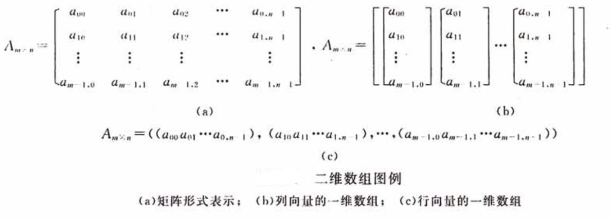

[[toc]]
> 线性表结构是数组结构的一个特例，数组结构是线性结构的扩展

**数组**：按一定格式排列起来的，具有像鸵鸟该诶西能的数据元素的集合？？

**一维数组**是由若干元素组成的一个有序序列，而其每个元素都通过一个下标来指定，且元素本身就是一个数据结构(整型、逻辑型、字符型等)，并且元素的类型相同占用相同的存储空间。
因此数组可以通过数组名及紧跟其后的方括号中的下标来确定，故一个一维数组就对应个一个下标函数。

**$n$维数组**类型可以定义为$n-1$维数组中的元素又是一个一维数组结构；即二维数组可以看成元素是一维数组结构的一维数组。
   

    
数组为多维的，但存储数据元素的内存单元地址是一维的，因此，在存储数组结构之前，需要解决将多维关系映射到一维关系的问题，即数组的存储可将其转换为一维来实现，所以必须对高维数组元素的存放次序进行约定。
高维数组通常有两种存放次序：按行优先顺序、按列优先顺序。
按行优先顺序：将高位数组元素按行向量的顺序存储，第$i+1$个行向量存储在第$i$个行向量之后。
按列优先顺序：将数组元素按列向量的顺序存储，第$i+1$个列向量存储在第$i$个行向量之后。  

数组结构定义好后，一旦数组的维数和维界确定好后，数组的规模就确定了，除了结构的初始化和销毁之外，只有取元素和修改元素值的操作，不做插入和删除操作。
根据数组结构存储的特点，只要给出一组下标便能求得相应数组元素的存储位置。以行序为先序存储时，假设每个数据元素占$L$个存储单元，则二维数组$A$中任一元素$a_{ij}$的存储位置即为：
$$LOC(i,j)=LOC(0，0)+(b_2*i+j)L$$
$LOC(i,j)$是$a_{ij}$的存储位置，$LOC(0,0)$是$a_00$的存储位置，

