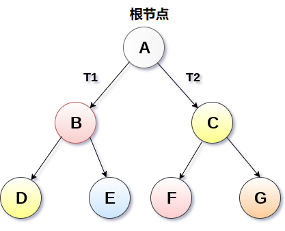
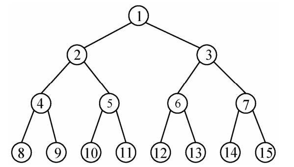
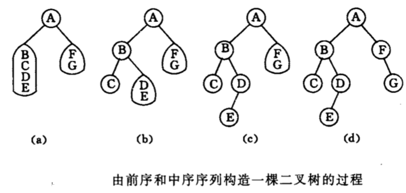
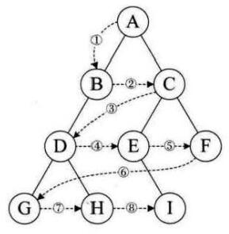
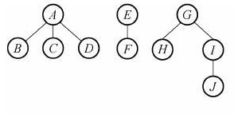

[[toc]]
## 1. 树的定义和基础术语
### 1.1 树的定义
**树**：具有$n(n\ge 0)$个结点的有限集


* **空数**：$n=0$
* 仅有一个特定的成为根的结点, 其余结点可分为$m(m\ge 0)$个互不相交的有限集，其中每一个集合本身又是一棵树，并成为根的子树

### 1.2 树的基础术语
**根结点**：非空树中无前驱结点的结点

**结点的度**：结点拥有的子树数

**树的度**：树内各结点的度的最大值

**树的深度**：树中结点的最大层次

**结点的子树的根成为该结点的孩子，该结点称为孩子的双亲**

**叶子**：终端结点

**内部结点**：根结点以外的分支结点

**非终端结点**：度不为0的分支结点

**有序树**：树中结点的各子树从左到右有次序

**无序树**：树中结点的各子树无次序

**森林**：$m(m\ge 0)$棵互不相交的树的集合

* 一棵树可以看成一个特殊的森林
* 森林中的各子树加上一个双亲结点，森林便变成了树

### 1.3 树结构和线性结构的比较
**线性结构**：第一个元素无前驱，最后一个元素无后继，其他元素仅有一个前驱一个后继，数据一对一

**树结构**：根结点无双亲，叶子结点无孩子，其他结点仅一个双亲多个孩子，数据一对多

## 2.二叉树
**二叉树**：由$n(n\ge 0)$个结点组成的有限集，除空集外，每一个根结点及两棵互不相交的分别称为这个根的左子树和右子树



**特点**：
* 二叉树的度不超过2
* 子树有左右之分，其次序不能颠倒
* 二叉树可以是空集，根也可以有空的左子树或空的右子树

**二叉树与树的区别**：
1. 二叉树不是树的特殊情况
2. 二叉树节点的子树要区分左子树或右子树；树结点只有一个孩子时，无需分区其左右次序。

**案例**：
1. 数据压缩-编码
2. 利用二叉树求解表达式的值

**二叉树的性质**：
1. 在二叉树的第i层上最多有$2^(i-1)$个结点,最少有1个结点
2. 深度为k的二叉树最多有$2^i-1$个结点($k\ge 1$)
3. 对任何一颗二叉树$T$,如果其叶子数为$n_0$,度为2的结点数为$n_2$，则$n_0=n_2+1$

**满二叉树**：一棵树深度为$k$且有$2^k-1$个结点($k\ge 1$)的二叉树



**特点**：
1. 每一层上的结点数都是最大结点数
2. 叶子结点全部在最底层

**满二叉树结点位置的编码规则**：从根结点开始，自上而下，自左而右；每一个结点位置都有元素

**完全二叉树**：($k\ge 1$)


**完全二叉树**：深度为k的具有$n$个结点的二叉树，当且仅当其每一个结点都与深度为$k$的满二叉树的编号$1\to n$的结点一一对应

**在满二叉树中，从最后一个结点开始，连续去掉任意个结点，即是一棵完成二叉树**

**特点**：
1. 叶子只能分布在层次较大的两层上
2. 对任一结点，如果其右子树的最大层次为$i$，则左子树的最大层次必为$i$或$i+1$

**性质**：
1. 具有n个结点的完全二叉树的深度为$\lfloor log_{2n} \rfloor +1$

### 2.1二叉树顺序存储
**二叉树顺序存储**：按满二叉树的结点层次编号，依次存放二叉树中的数据元素


**存储格式**：
$$
\begin{pmatrix}
1&2$3$4$5$6$7$8$9$10$11$12\\
\end{pmatrix}
$$

**缺点**：
1. 只适合存储满二叉树或完全二叉树，最坏情况：深度为k的且只有k个结点的单支树需要长度为$2^k-1$的数组

### 2.2二叉树链式存储
**二叉树链式存储**：每个结点由数值域，左子树指针、右子树指针组成


在$n$个结点的二叉链表中，有$n+1$个空指针域

### 2.3二叉树遍历
**遍历**：顺着某一条搜索路径寻访二叉树中的结点，使得每个结点均被访问一次，而且仅被访问一次
**方法**：依次遍历二叉树中的三个组成部分，便是遍历了整个二叉树

#### 2.3.1先序遍历
**步骤**：若二叉树为空，则空操作
1. 访问根结点
2. 先序遍历左子树
3. 先序遍历右子树


先序遍历结果：$ABELDHMIJ$

* 先序遍历递归算法
```
void preOrderTraverse(BiTree T){
if(T==null) return ;// 空二叉树
else {
    visit(T);// 访问根结点
    preOrderTraverse(T->lchild);//递归遍历左子树
    preOrderTraverse(T->rchild);//递归遍历右子树
    }
}
```
* 先序遍历非递归算法

#### 2.3.2中序遍历
**步骤**：若二叉树为空，则空操作
1. 中序遍历左子树
2. 访问根结点
3. 中序遍历右子树


中序遍历结果：$ELBAMHIDJ$

* 中序遍历递归算法
```
void inOrderTraverse(BiTree T){
if(T==null) return ;// 空二叉树
else {
    inOrderTraverse(T->lchild);//递归遍历左子树
    visit(T);// 访问根结点
    inOrderTraverse(T->rchild);//递归遍历右子树
    }
}
```

* 中序遍历非递归算法

基本思想：
1. 建立一个栈
2. 根结点进栈，遍历左子树
3. 根结点出栈，输出根结点，遍历右子树
```
void inOrderTraverse(BiTree T){
  【算法实现】
}
```

#### 2.3.3后序遍历
**步骤**：若二叉树为空，则空操作
1. 后序遍历左子树
2. 后序遍历右子树
3. 访问根结点


后序遍历结果：$LEBMIHJDA$

* 后序遍历递归算法
```
void inOrderTraverse(BiTree T){
if(T==null) return ;// 空二叉树
else {
    inOrderTraverse(T->lchild);//递归遍历左子树
    inOrderTraverse(T->rchild);//递归遍历右子树
    visit(T);// 访问根结点
    }
}
```
* 后序遍历非递归算法

#### 2.3.4 先/中/后序遍历应用
* 数值表达式的前缀(波兰式)/中缀/后缀(逆波兰式)表达式


遍历结果：
1. 先序(波兰式)：$-*abc$
1. 中序：$a*b-c$
1. 后序(逆波兰式)：$ab*c-$

* 由遍历序列确定二叉树

1.已知先序和中序序列求二叉树

先序序列：$ABCDEFGHIJ$

中序序列：$CDBFEAIHGJ$

**特点：先序遍历，根结点必在先序序列头部**



2.已知中序和后续序列求二叉树

中序序列：$BDCEAFHG$

后序序列：$DECBHGFA$

**特点：后序遍历，根结点必在先序序列尾部**


* 先/中/后序遍历递归算法总结

**三种遍历的递归算法中每个结点都经过三次，且访问的路径是相同，只是访问结点值的时机不同。**


1. 先序遍历：第1次经过时访问
2. 中序遍历：第2次经过时访问
3. 后序遍历：第3次经过时访问

**时间效率**：$O(n)$// 每个结点只访问一次

**空间效率**：$O(n)$// 栈占用的最大辅助空间

#### 2.3.5层次遍历
**层次遍历**:从根结点开始，按从上到下、从左到右的顺序访问每一个结点(每个算法只访问一次)



层次遍历结果：$abfcdgeh$

**基本思想**：使用一个队列
1. 将根节点进队
2. 队不为空时循环：从队列中出列一个结点p，访问它

   2.1 若它有左孩子结点，将左孩子结点进队
   
   2.2 若它有右孩子结点，将右孩子结点进队

```
void levelOrder(BTNode T){
  【算法实现】
}
```

## 3.线索二叉树
问题：当用二叉链表作为二叉树的存储结构时，可以很方便的找到结点的左右孩子；但一般情况下，无法直接找到该结点在某种遍历序列中的前驱和前驱和后继结点

### 3.1线索二叉树的操作
**线索**：二叉链表的存储中存在空指针域，如果某个结点的左孩子为空，则将空的左孩子指针域改为指向其前驱，如果结点的右孩子为空，则将空的右孩子指针域改为指向其后继

**线索二叉树**：加上了线索的二叉树

**将二叉树按某种遍历次序使其变为线索二叉树的过程称为线索化。**

**二叉树的遍历-存储:**


为了区分左指针和右指针指向的是孩子还是前驱或后继，在二叉链表中每个结点增设两个标志域ltag和rtag：
1. ltag=0 ：左指针指向该结点的左孩子
1. ltag=1 ：左指针指向该结点的前驱
1. rtag=0 ：右指针指向该结点的右孩子
1. rtag=1 ：右指针指向该结点的后继

* 先序线索二叉树
* 中序线索二叉树
* 后序线索二叉树

**增设头结点**：
1. ltag=0，左指针指向根结点
1. rtag=1，右指针指向遍历序列中最后一个结点

遍历序列中第一个结点的左指针域和最后一个结点的右指针域均指向头结点


## 4.数和森林
**树**：具有n(n>=0)个结点的有限集

**森林**：m(m>=0)个互不相交的树的集合




### 4.1 树的存储结构
#### 4.1.1双亲表示法
**双亲表示法**：定义结构数组存放数的结点，每个结点包含数据域和双亲域。

**数据域**：存放结点本身信息

**双亲域**：指示本结点的双清结点在数组中的位置


**特点**：找双亲容易，找孩子难

#### 4.1.2孩子链表
**孩子链表**：把每个结点的孩子结点排列起来，看成是一个线性表，用单链表存储。则$n$个结点由n个孩子链表（叶子的孩子链表为空表）。$n$个头指针又组成一个线性表，用顺序表存储。


**特点**：找孩子容易，找双清难

#### 4.1.3二叉链表表示法
**二叉链表表示法**：用二叉链表作树的存储结构，链表中每个结点含有两个指针域：左指针指向第一个孩子结点，右指针指向下一个兄弟结点


### 4.2树和二叉树的转换
#### 4.2.1树转换成二叉树
**步骤**：(兄弟相连留长子)
1. 加线：在兄弟之间加一连线
1. 抹线：对每个结点，除其左孩子外，去除其与其他孩子之间的关系
1. 旋转：以树的根结点为轴心，将树顺时针转45度

#### 4.2.2二叉树转换成树
**步骤**：(左孩右右连双亲)
1. 加线：若$p$结点是双亲结点的左孩子，则将$p$的右孩子，右孩子的右孩子..沿分支找到的所有右孩子，都与$p$的双亲用线连起来
1. 抹线：去除原二叉树中双亲与右孩子之间的连线
1. 调整：将结点按层次排列，形成树结构

### 4.3森林和二叉树的转换
#### 4.3.1森林转二叉树
**步骤**：(树变二叉根相连)
1. 将各棵树分别转换成二叉树
1. 将每棵树的根结点用线相连
1. 以第一棵树的根结点为二叉树的根，再以根结点为轴心，顺时针旋转，构成二叉树型结构

#### 4.3.2二叉树转森林
**步骤**：(去掉全部右孩先，孤立二叉再还原)
1. 抹线：将二叉树中根结点与其右孩子连线，沿右分支搜索到的所有右孩子间连线全部抹掉，使之变成孤立的二叉树
1. 还原：将孤立的二叉树还原成树


### 4.4 树和森林的遍历
#### 4.4.1树的遍历
1. 先根遍历： 若树不为空，先访问根结点，再依次先根遍历各棵子树
1. 后根遍历： 若树不为空，先依次遍历各棵子树，再访问根结点
1. 层次遍历： 若树不为空，自上而下、自左至右访问树中每个结点

#### 4.4.2森林的遍历
将森林看做三个部分组成：
1. 森林中第一棵树的根结点
1. 森林中第一棵树的子树森林
1. 森林中其他树构成的森林

**森林的遍历**：
1. 先序遍历： 若树不为空，依次从左到右对森林中的每一棵树进行先根遍历
1. 中序遍历： 若树不为空，依次从左到右对森林中的每一棵树进行后根遍历

## 5.赫夫曼树
### 5.1基础概念
**路径**：从树中一个结点到另一个结点之间的分支构成这两个结点间的路径

**结点的路径长度**：两结点间路径上的分支数

**树的路径长度**：从树根到每一个结点的路径长度之和

**权**：将树中结点赋给一个有着某种含义的数值，则该值成为结点的权

**结点的带权路径的长度**：从根结点到该结点之间的路径长度与该结点的权的乘积

**树的带权路径长度**：树中所有叶子结点的带权路径长度之和

**最优二叉树**：带权路径长度最短的二叉树

### 5.2赫夫曼树构造算法
#### 5.2.1构造算法
**赫夫曼树中权越大的叶子离根越近**

**构造方法**：
1. 构造森林全是根
1. 选用两小造新树
1. 删除两小造新人
1. 重复2、3剩单根


**总结**：
1. 包含n棵树的森林要经过$n-1$次合并才能形成赫夫曼树，共产生$n-1$个新结点，且该$n-1$个新结点都具有两个孩子的分支结点
1. 赫夫曼树共有$2n-1$个结点，且所有分支结点的度均不为1

#### 5.2.2构造算法实现
**采用顺序存储结构，使用一维结构数组**

**权重**：双亲结点下标：左孩子结点下标：右孩子结点下标


#### 5.3赫夫曼编码
**要求**：使用不定长编码，且任意字符的编码都不是另一个字符编码的前缀

**赫夫曼编码**：
1. 统计字符集中每个字符出现的平均概率（频率越大，编码越短）
1. 将每个字符的概率值作为权值构造赫夫曼树(概率越大，路径越短)
1. 在赫夫曼树的每个分支上标0或1： 左分支为0，右分支为1；把从根结点到每个叶子的路径上的标号连接起来，作为该叶子的字符编码


**解码**：
1. 构造赫夫曼树
1. 依次读入二进制码，一旦到达某叶子结点时，即可译出字符
1. 再从根结点出发继续译码，直到结束


## 6.分类和决策树
