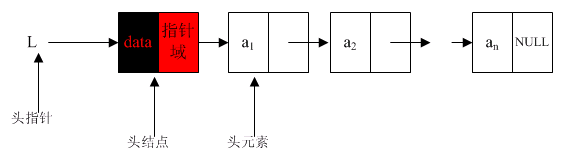
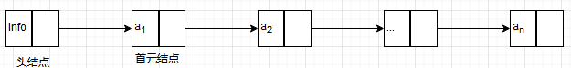

[[toc]]
## 1.线性表的类型定义
**线性表**：由0或多个具有相同类型的结点组成的有序集合。
$$
(a_1,a_2,a_3,...,a_n)
$$
      
当$n=0$时，线性表中无节点，这样的线性表为空表；当$n\ge 1$时，$a_1$为线性表的表头，$a_n$为线性表的表尾；当$n\ge 2$时，$a_i$为$a_{i+1}$的前驱结点，$a_{i+1}$为$a_i$的后驱结点

**线性表的基本操作：**
1. 创建一个线性表
2. 确定线性表的长度
3. 确定线性表是否为空
3. 存取表中指定位置结点的字段值
4. 查找指定字段值的表中的位置
5. 删除表中指定位置的结点
6. 在表中指定位置插入一个新结点

## 2.线性表的顺序存储结构
**顺序存储方式**：用一组连续的存储地址来存储线性表中的结点的存储方式

**顺序表**：按照顺序存储方式存储的线性表称为顺序表

线性表
$$(a_1,a_2,a_3,...,a_n)$$

存储结构：

**特点**：
1. 存储地址连续
1. 数据元素存储依次存放
1. 数据元素类型相同
1. 数据元素可随机存取

**优点**：存储空间的利用率高，存取速度快

**缺点**：
1. 在插入、删除某个元素时，需要移动大量元素
1. 静态存储形式，数据元素的个数不能自由扩充

## 3.线性表的链式存储结构
**结点**：数据元素的存储映像。由数据和指针域两部分组成

数据域存放该结点的数据域的值，指针域存放该结点的后继结点的地址信息

**链表**：$n$个结点由指针链组成一个链表

链表的存储单元可以是连续的，也可以是不连续的，结点见的逻辑顺序与物理存储顺序之间没有必然联系

**头指针**：指向链表中第一个结点的指针

**首元结点**：链表中存储第一个数据元素的结点

**头结点**：链表的首元结点之前附设的一个结点

头结点的数据域可以为空，也可以存放线性表长度等附加信息，但此结点不能计入链表长度值

**链式存储特点**：
1. 结点在存储器中的位置是任意的
2. 访问时只能通过头指针进入链表，并通过每个结点的指针域一次向后顺序扫描其他结点，所以寻找第一个结点和最后一个节点所花的时间不等

### 3.1 单链表
**单链表**：结点只有一个指针域的链表

**带头结点的单链表**：

**空表**：

**缺点**：从单链表的一个结点出发，只能访问链表的后继结点，而无法访问其前面的结点。

**常见操作**：

### 3.2 循环链表
**循环链表**：链表最后一个结点的指针域指向头结点。链表形成一个环

**空循环链表**：单链表质保函一个头指针执行的哨位结点，其指针域存放指向自身的指针。

**遍历操作**：终止条件为结点是否为头指针

**优点**：从链表的任意位置可以访问链表中的任意结点
**缺点**：从一个结点出发，必须遍历整个链表，才能获得其前驱结点

**常见操作**：

### 3.2 双向链表
**双向链表**：结点有两个指针域的链表。任一结点由数据域、左指针域、右指针域组成

左指针域和右指针域分别存放结点左右相邻结点的地址信息。

链表中的表头结点的左指针和表尾结点的右指针均为$null$

**双向循环链表**：在双向链表的基础上，让头结点的左指针指向链表的最后一个结点，让最后一个结点的右指针指向头结点

**常见操作**：

### 3.3 总结
* 链式存储结构的优点：
1. 结点空间可以动态申请和释放；
2. 数据元素的逻辑次序靠结点的指针来指示，插入和删除时不需要移动数据元素

* 链式存储结构的缺点：
1. 存储密度小，每个结点的指针域需额外占用存储空间，当每个结点的数据域所占字节不多时，指针域所占存储空间的比重很大。
存储密度： 结点数据存储量/整个链表存量

* 顺序表和链表的比较

## 4.线性表的应用
线性表的合并
有序表的合并
