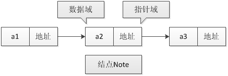
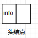
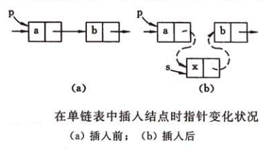
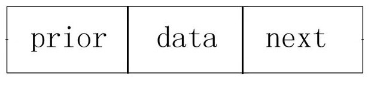
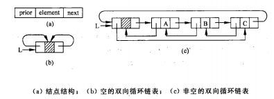
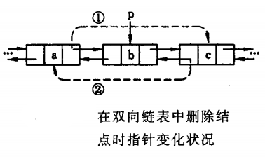

[[toc]]
## 线性表的定义
> 线性表是较为常见的线性数据结构。日常中常见的点名册、电话簿、职工工资单等都是线性表示例。简单地说，线性表就是结点的有限集合

**线性表**是由0或多个具有相同类型的结点组成的有序集合。若用$(a_1,a_2,a_3,...,a_n)(n为自然数)$表示一个线性表。当$n=0$时，线性表中无节点，这样的线性表为空表；当$n\ge 1$时，称$a_1$
为线性表的表头，$a_n$为线性表的表尾；当$n\ge 2$时，$a_i$为$a_{i+1}$的前驱结点，$a_{i+1}$为$a_i$的后继结点。当$n=1$时，线性表只有一个结点，该节点即是表头也是表尾。线性表元素的个数$n(n
\ge 0)$称为线性表的长度

线性表中的元素可以是各种各样的，但同一个线性表中的元素必定具有相同的特性，即属同一数据对象，相邻数据元素存在着序偶关系。

**线性表的基本操作：**
1. 创建一个线性表
2. 确定线性表的长度
3. 确定线性表是否为空
3. 存取表中指定位置结点的字段值
4. 查找指定字段值的表中的位置
5. 删除表中指定位置的结点
6. 在表中指定位置插入一个新结点

## 线性表的顺序表示
用一组连续的存储地址来存储线性表中的结点的存储方式称为**顺序存储方式**
按照顺序存储方式存储的线性表称为**顺序表**；简而言之，程序中使用定长的一维数组，按照书序存储方式存储的线性表即为顺序表。若顺序表中的元素按其值有序，则称其为有序顺序表。

若线性表中每个元素占用$l$个存储空间，并以第一个元素所占的第一个存储单元为起始存储位置，在线性表中第$i$个和第$i+1$个元素的存储位置具有以下关系：
$$LOC(a_{i+1})=LOC(a_i)+l$$
第$1$个和第$i$个元素的存储位置：
$$LOC(a_i)=LOC(a_1)+(i-1)l$$
所以在顺序表中，若两个结点在表中使逻辑相邻的，则他们的存储地址是物理相邻的，即只要给定表头结点$a_1$
的存储地址和存储结点所需的字节数，便可确定表中任一结点的存储地址，从而实现对结点的随机存取操作。即线性表的顺序存储结构是可以随机存取的存储结构

线性表$(a_1,a_2,a_3,...,a_n)$的存储结构如下图所示：

**顺序表的插入**：
长度为$n$的顺序表$A$的下标为$i$的结点后插入一个字段值为$item$的结点，只需将下标大于$i$结点的结点均后移一个位置，同时保证初始化时分配的顺序表存储空间未满，并且插入位置合法。插入成功后，线性表长度变为$n+1$

**顺序表的删除**：
长度为$n$的顺序表$A$的下标为$i$的结点删除，只需将下标大于$i$结点的结点均前移一个位置。删除成功后，线性表长度变为$n-1$

不管线性表中实际的结点个数是几个，都需要在线性表初始化时分配$MaxSize$大小的存储空间，所以有时会造成空间的浪费；同时顺序表的删除和插入都要移动大量的元素，时间花销大。

**总结**：
特点：存储地址连续，数据元素存储依次存放；数据元素类型相同，数据元素可随机存取
优点：存储空间的利用率高，存取速度快，适用于存取需求多的线性表
缺点：静态存储形式，数据元素的个数不能自由扩充(受存储空间的限制)；在插入、删除某个元素时，需要移动大量元素

## 链式存储结构
> 线性表的顺序存储使用一段连续的物理地址存储数据，可以随机存取任意元素，但是在进行插入和删除操作时需要移动大量的元素。因此本节介绍链式存储，元素的存储位置随意，可以是连续的也可以是不连续，即结点的逻辑关系与物理存储位置之间没有关联，从而在不移动结点的情况下插入、删除结点

采用任意的存储单元存储线性表的数据元素是线性链表的特点。而为了表示两个元素之间的逻辑关系，需要知道直接后继的存储位置。
数据元素的存储映像称为**结点**，其中结点由**数据域**和**指针域**两部分组成。**数据域**存放该结点的数据域的值，**指针域**存放该结点的前继或后继结点的地址信息

由$n$个这样的结点连接成的线性表成为**链表**，根据结点指针域的不同，链表主要分为单链表、循环链表和双向链表。

链表中存储第一个数据元素的结点称为**首元结点**；在链表的首元结点之前附设的一个结点，该结点称为**头结点**，头结点的数据域可以为空，也可以存放线性表长度等附加信息，但此结点不能计入链表长度值；在头结点之前增设一个**头指针**指向链表中第一个结点。

### 单链表：
结点只有一个指针域的链表。数据域data存放该节点的数据域的值，指针域next存放该节点的后继结点的地址信息

链表的第一个结点称为首元结点，最后一个结点称为尾结点，尾结点的指针域为null

对链表进行操作时，如果删除的是首元结点，则头指针每次都需修改，所以为了解决该问题，在首元结点前添加一个结点，称为头结点。头结点的结构与其他结点的结构相同，指针域指向首元结点，数据域可为空，也可存储链表信息。

若表中只有个头结点，则链表长度为0，此时称其为**空表**

在链表中若$p$为指向第$i$个元素的指针，则$p.next$指向第$i+1$个元素,$p.data=a_i$，$p.next.data=a_{i+1}$
。所以访问时链表中某个结点时，只能通过头指针进入链表，并通过每个结点的指针域依次向后顺序扫描其他结点，并找到指定结点，所以寻找第一个结点和最后一个节点所花的时间不等

**单链表的插入**：

若要将结点$x$插入到已存在的链表中，只需要修改链表中的指针即可。

如图所示：首先找到结点$x$应插入的位置，然后将$a$结点的指针修改为指向$x$结点，将$x$的指针指向$b$。若$p$为指向结点$a$的指针，则指针的修改关系为：

$$x.next=p.next,  p.next=x$$

**单链表的删除**：

与单链表的插入类似，若要删除链表中的某结点，只需要修改链表的指针即可。

如图所示：首先找到删除结点$b$的前一个结点$a$,然后将$a$结点的指针指向$c$结点。若$p$为指向结点$a$的指针，则指针的修改关系为：

$$p.next=p.next.next$$

### 循环链表
> 从单链表的一个结点出发，只能访问链接在它后面的结点，而无法访问其前驱结点，根据单链表尾结点的指针域为空的特点，将尾结点的指针域指向头结点，从而使链表任何结点可以访问任意结点。

单链表最后一个结点的指针域指向头结点，形成一个环的链表称为**循环链表**

当循环链表只包含一个头指针指向的头结点，其指针域存放指向自身的指针，称为**空循环链表**

* 循环链表可以从任意位置访问任意结点，所以链表遍历一遍的终止条件为结点的指针是否指向头指针，但是想获取结点的前驱结点，仍需遍历整个链表。
循环链表的插入和删除与单链表类似。

### 双向链表
>循环链表从一个结点出发，循环遍历整个链表，才能找到其前驱结点，时间花费长，所以引入双向链表解决该问题。

结点有两个指针域的链表成为**双向链表**。结点由**数据域**、**左指针域**、**右指针域**组成；左指针域和右指针域分别存放结点左右相邻结点的地址信息。

其中链表中的表头结点的左指针和表尾结点的右指针均为$null$

在双向链表的基础上，让头结点的左指针指向链表的最后一个结点，让最后一个结点的右指针指向头结点，这样的链表称为**双向循环链表**。

与单链表相似，在链表中若$p$为指向第$i$个元素的指针，则$p.next$指向第$i+1$个元素，$p.prior$指向第$i-1$个元素,因此有以下关系：
$$p.prior.next=p.next.prior=p$$

所以每个结点可以便利的访问其前驱结点和后驱结点

**双向链表的插入**：
与单链表相似，若要将结点$x$插入到已存在的链表中，只需要修改链表中的前驱和后继指针即可。

如图所示：首先找到结点$x$应插入的位置，然后将$a$结点的后继指针修改为指向$x$结点，$x$的后继指针指向$b$，$b$的前驱指针指向$x$，$x$的前驱指针指向$a$。若$p$为指向结点$b$的指针，则指针的修改关系为：

$$
 x.prior=p.prior,\quad
p.prior.next=x,\quad
x.next=p,\quad
p.prior=x
$$

**双向链表的删除**：
与单链表的删除类似，若要删除链表中的某结点，只需要修改链表的前驱和后继指针即可。

如图所示：首先找到删除结点$b$,然后将$a$结点的后继指针指向$c$结点，$c$结点的前驱指针指向$a$结点。若$p$为指向结点$b$的指针，则指针的修改关系为：

$$
p.prior.next=p.next,\quad
p.next.prior=p.prior
$$

### 总结
* 链式存储结构的优点：
1. 结点空间可以动态申请和释放；
2. 数据元素的逻辑次序靠结点的指针来指示，插入和删除时不需要移动数据元素

* 链式存储结构的缺点：
1. 存储密度小，每个结点的指针域需额外占用存储空间，当每个结点的数据域所占字节不多时，指针域所占存储空间的比重很大。
存储密度： 结点数据存储量/整个链表存量

## 顺序表和链表的比较
【添加】

