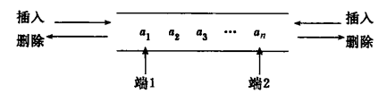

[[toc]]
## 队列的定义
> 队列是操作受限的线性表，只能在表的一端进行插入，在另一端进行删除。具有先进先出的原则

只能在表的一端进行插入，另一端进行进行删除，且操作具有先进先出的原则的线性表成为**队列**

在队列中进行删除的一端称为队头，进行插入的一端称为队尾；插入数据到队尾的操作称为入队，从队头删除最后一个元素操作称为出队。假设栈$S=(a_1,a_2,a_3,...,a_n)$ ,则$a_1$为队头元素，$a_n$
为队尾元素；没有元素的队列称为空队列。

**队列基本操作**：
1. 向队尾添加元素(入队)
1. 删除队首元素(出队)
3. 获取队首的元素值(存取)
4. 判断队列是否为满
5. 判断队列是否为空

**\*双端队列**：

限定插入和删除操作在表的两端进行的线性表称为**双端队列**

也可以有输出受限的双端队列(一个端点只允许插入和删除，另一个端点只允许插入)和输入受限的双端队列(一个端点只允许插入和删除，另一个端点只允许删除)。同时双端队列也可以退化成栈，即只能在一端进行插入和删除。

## 顺序队列
用顺序存储方式存储的队列称为**顺序队列**
【插图】

**删除队列头元素的两种方式**：
* 不要求队头元素必须存放在数组的一个位置。每次删除队头元素，只需要修改队头指针front所指的位置，即$front=front+1$.
该方式的优点是无须改变队列其他元素地址，缺点是front值随着队头元素的删除而增加，整个队列向数组的后端位置移动，随着队尾元素的不断加入，必然出现数组后端没有可用空间的情况，而数组的前端大量空间被闲置。
* 要求队头元素必须存放在数组的第一个位置。每次删除队头元素，令所有的元素都向前移动一个位置。
该方式的优点是不浪费空间，缺点是所有元素的存储位置都必须改变，效率低下

顺序队列之入队：在队尾插入一个元素。因为队列用数组存放，所以插入前判断队列是否为满。插入操作除了将新元素存入队尾，还要更新队尾下标

顺序队列之出队：删除队首元素。删除之前需判断队列是否为空，删除操作实际就为更新队首元素下标。

顺序队列之存取队首

## 循环队列
> 为了解决顺序队列删除元素时出现的问题，可以假定数组是循环的，即采用环形模型来实现顺序队列来提升运算效率与空间效率之间的矛盾

队列在线性存储时，当队尾指针指向队列最后一个位置末时不能再插入新的元素，而队列的实际可用空间未占满时，将队头与队尾连接形成闭环，此时称队列为**循环队列**

循环队列时逻辑上置于一个圆环上，变量front存放队头位置，没删除一个队头元素，front顺时针移动一个位置；变量rear存放新元素要插入的位置(下标),每插入一个元素，rear将顺时针移动一个位置。

判断队列满的两种方式：
1. 设置一个变量count存储队列元素的个数，当count等于数组规模maxsize时，说明队列已满；当count=0时队列为空。以此来判断队列为空或满
1. 少用一个元素空间，当队列头指针在队尾指针的下一位置时，队列为满。

## 链式队列
用链接存储方式实现的队列称为**链式队列**

队列的主要操作都在队首和队尾进行，所以链式队列应包含两个指针：队首指针front和队尾指针rear，分别存放队首和队尾结点的地址信息。链式队列的结点结构扔采用单链表的结点结构。

// ？？链式队列中需要首尾指针分别指向队首和队尾，并在队首添加头结点，并使头指针指向头结点。链式队列的插入和删除只需修改尾指针即可。

链式队列的入队：在队尾插入一个新元素。为新元素申请一个接地那空间，然后修改原队尾结点的next域指针和队尾指针，令它们均保存新结点的地址信息。若插入前队列为空，只需修改头指针，令其指向新结点

链式队列的出队：删除队首元素。先判断队列是否为空，若队列非空则执行出队操作，出队后还要再次判断队列是否为空，以确保是否要修改队尾指针

## 顺序队列与链式队列的比较
* 顺序表有固定的存储空间，不适用于存储空间很大，删除插入很频繁的操作，此时顺序表的空间利用率很低，但链式队列却可适用此情况。
* 顺序队列在访问上很简单，对队列内部元素(不限于队列的队首和队尾，此时可将队列看做数组)的访问很方便。
* 
