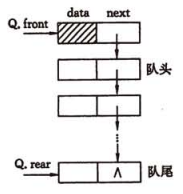

[[toc]]
## 1.队列
**队列**：所有的插入都在表的一端进行，所有的删除都在表的另一端进行，且操作具有先进先出的原则

进行删除的一端称为队头，进行插入的一端称为队尾。没有元素的队列称为空队列。队列是一种受限的线性表

插入数据到队尾的操作成为入队，从队头删除最后一个元素操作成为出队

**队列基本操作**：
1. 向队尾添加元素
1. 删除队首元素
3. 获取队首的元素值
4. 判断队列是否为满
5. 判断队列是否为空

### 1.1顺序队列
**顺序队列**：用顺序存储方式存储的队列为顺序队列
【插图】

**删除队列头元素的两种方式**：
* 不要求队头元素必须存放在数组的以一个位置。每次删除队头元素，只需要修改队头指针所知的位置。
* 要求队头元素必须存放在数组的第一个位置。每次删除队头元素，令所有的元素都向前移动一个位置。

### 1.2链式队列
**链式队列**：用链接存储方式实现的队列称为链式队列

队列的主要操作在队首和队尾进行，所以链式列表只有：队首指针和队尾指针，分别存放队首和队尾结点的地址信息。
### 1.3循环队列

## 3.队列的应用
