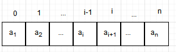

[[toc]]
## 线性表的顺序存储结构
**顺序存储方式**：用一组连续的存储地址来存储线性表中的结点的存储方式

**顺序表**：按照顺序存储方式存储的线性表称为顺序表

线性表
$$(a_1,a_2,a_3,...,a_n)$$

存储结构：

**特点**：
1. 存储地址连续
1. 数据元素存储依次存放
1. 数据元素类型相同
1. 数据元素可随机存取

**优点**：存储空间的利用率高，存取速度快

**缺点**：
1. 在插入、删除某个元素时，需要移动大量元素
1. 静态存储形式，数据元素的个数不能自由扩充